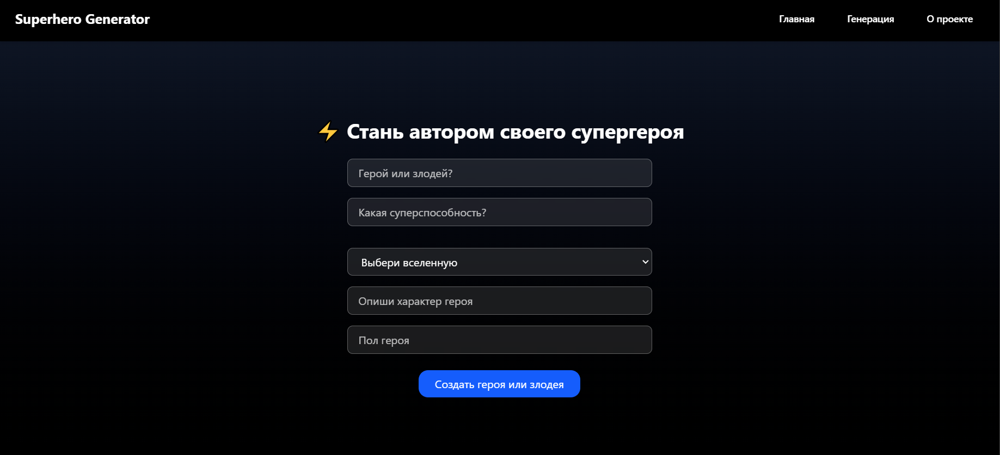
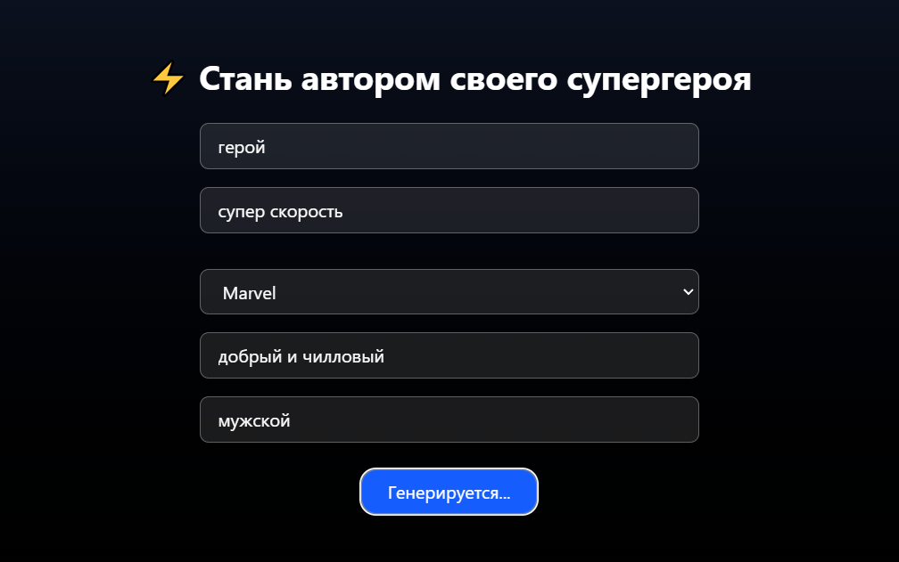
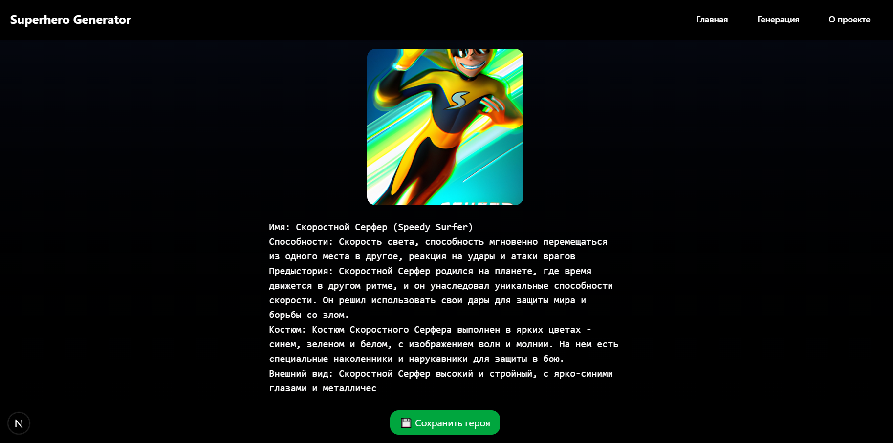
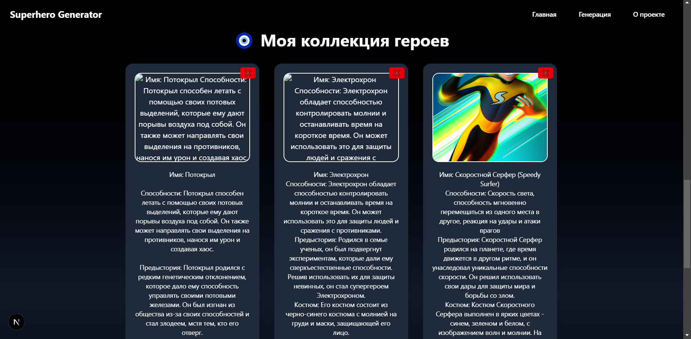

# ⚡ Superhero Generator

**Superhero Generator** — это веб-приложение, в котором каждый может создать уникального супергероя, отвечая на простые вопросы. На основе введённых данных используется AI (OpenAI API), чтобы сгенерировать не только детальное описание героя, но и его изображение.

> 🎯 Этот проект создан в рамках хакатона 2025, чтобы показать, как можно объединить интерактивность, кастомизацию и нейросети для создания уникального пользовательского опыта.

---

## 🔥 Фичи

- ✅ Генерация супергероя с описанием и изображением, которое можно коллекционировать, сохраняя на localhost
- ✅ Ввод персонализированных данных: роль, суперспособность, характер, вселенная и т.д.
- ✅ Использование OpenAI API для генерации текста
- ✅ Автоскролл, плавная анимация, стилизованные кнопки и формы
- ✅ Tailwind CSS + Shadcn UI для современного интерфейса
- ✅ Разработано на **Next.js + TypeScript**

---

## 🧠 Используемые технологии

- **Next.js** — современный React-фреймворк
- **TypeScript** — строгая типизация для стабильности проекта
- **Tailwind CSS** — быстрая и кастомизируемая стилизация
- **Shadcn/UI** — красивый UI-kit на основе Radix
- **OpenAI API** — генерация описания супергероя
- **Vercel** — хостинг/деплой проекта (⚠️ генерация на нём может не работать — см. скриншоты ниже)

---

## 📸 Скриншоты функционала

> Ниже представлены скриншоты, демонстрирующие все ключевые части работы приложения. Это сделано для того, чтобы жюри могли полностью оценить функциональность, даже если часть логики не работает на Vercel.

### 🧪 Секция генерации героя


### ⚙️ Процесс генерации


### 🎯 Результат генерации


### 📁 Коллекция сгенерированных героев (они хранятся на localstorage и после нажатия на кнопку "сохранить" нужно обновить страницу)


---

## 🚀 Запуск проекта локально

```bash
# Клонировать репозиторий
git clone https://github.com/ondyyvfx/Hackathon-AI-Wrapper
cd superhero-generator

# Установить зависимости
npm install

# Запустить сервер разработки
npm run dev
